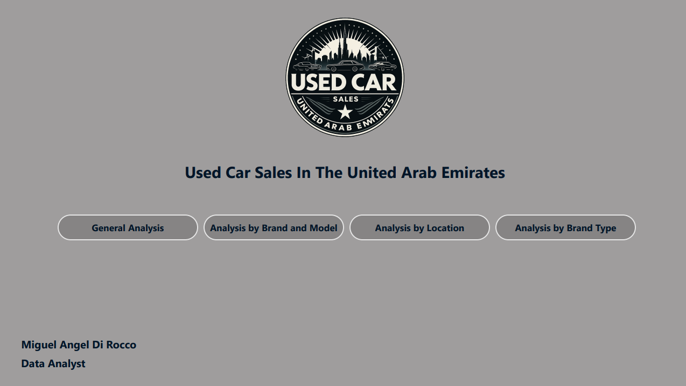

# 🚗 Entrega 3 - Proyecto de Análisis de Ventas de Autos Usados (Power BI)

> **Carrera:** Data Analytics  
> **Institución:** Coderhouse  
> **Alumno:** Miguel Ángel Di Rocco  
> **Entrega:** Proyecto 3 - Visualización y análisis en Power BI  
> **Tema:** Mercado de autos usados en Emiratos Árabes Unidos  

---

## 📌 Descripción general

Este proyecto consiste en el desarrollo de un **dashboard profesional en Power BI** para analizar el mercado de ventas de autos usados en Emiratos Árabes Unidos.  
Incluye todo el ciclo de trabajo del analista de datos: limpieza, modelado, creación de medidas y visualizacion.

El objetivo es generar **insights claros y accionables** para ayudar a concesionarias o plataformas de venta a entender tendencias, demandas y oportunidades.

---

## 📊 ¿Qué contiene este repositorio?

- `dashboard.pbix` → Archivo de Power BI con el modelo relacional, transformaciones, medidas DAX y visualizaciones
- `documentacion_proyecto.pdf` → Informe completo explicando el proceso realizado
- Carpeta `assets/` → Capturas del dashboard y gráficos incluidos en el informe
- `README.md` → Este archivo, con la presentación del proyecto

---

## 🧠 Objetivos del análisis

- Detectar las **marcas, modelos y tipos de autos más vendidos**
- Analizar el **impacto del tipo de combustible, kilometros y carrocería**
- Visualizar el comportamiento del mercado por **ubicación , condición del vehículo y tipo de combustible**
- Ofrecer un informe visual **intuitivo, interactivo y útil** para la toma de decisiones

---

## ⚙️ Proceso realizado

### 🔁 1. Limpieza y transformación (Power Query)
- Separación de tabla de hechos y dimensiones
- Cambio de nombres de columnas para consistencia
- Creación de claves primarias únicas en tablas de dimensiones
- Eliminación de duplicados
- Tipado de columnas: fechas, textos, numéricos
- Creación de tabla calendario sin conectar al modelo
- Creación de tabla medidas
- Medidas con DAX para mejores análisis
- Nueva columna tipo de marca (lujo,convensional)

### 🧱 2. Modelado de datos
- Diseño de un **modelo estrella**
- Relación entre tabla de hechos y dimensiones
- Inclusión de **tabla calendario** (marcada _Calendar_Table)

### 🧮 3. Cálculo de métricas (DAX)
- Creación de medidas como:
  - Total de vehiculos
  - Precio promedio
  - Marcas y modelos mas vendidas
  - Comparativas entre combustibles, transmisiones y carrocerías
    

### 📈 4. Visualización
- KPIs destacados
- Segmentadores dinámicos (Marca, modelo, año de modelo, tipo de marca)
- Gráficos interactivos distribuidos en 4 solapas temáticas + 1 solapa de portada

---

## 📷 Capturas del Dashboard

  
    
  
    
  
    
  
    
  

---

## 📄 Informe en PDF

---

## 📫 Contacto

Miguel Ángel Di Rocco  
📧 migueldirocco.ds@gmail.com  
🔗 [LinkedIn](https://www.linkedin.com/in/miguelangeldirocco/)  
📁 [Portfolio](https://github.com/MiguelAngelDiRocco)

---

## ✅ Estado del proyecto

> ✔️ Entrega finalizada 
> 📊 Dashboard funcional y optimizado  
> 🧠 Disponible para revisión o mejora futura

---
